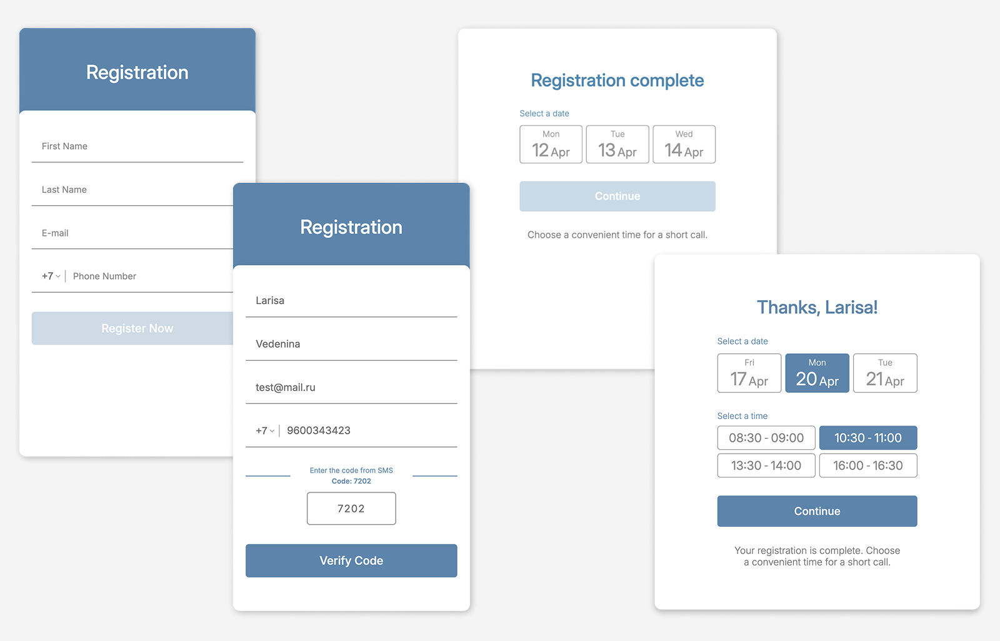

# Multi-Step Registration Form

<p align="center">Многошаговая форма регистрации, разработанная от дизайн-макета до готовой фронтенд-реализации на JavaScript.</p>

<p align="center">
  
  
  
  
</p>

<p align="center">
  
</p>

## О проекте

Это самостоятельный фронтенд-кейс, оформленный для портфолио.

Изначально форма появилась в рамках рабочей задачи, а затем была адаптирована для портфолио. В проекте были проработаны дизайн-макет, пользовательский сценарий, верстка интерфейса и логика шагов на `vanilla JavaScript`.

## Что сделано в проекте

- дизайн-макет формы
- структура шагов и переходов между ними
- верстка интерфейса на `HTML` и `CSS`
- логика на `JavaScript` без библиотек
- адаптация проекта для портфолио

## Как работает сценарий

1. Пользователь вводит имя, фамилию, email и номер телефона
2. После корректного заполнения появляется captcha
3. После правильного ввода captcha открывается шаг с SMS-кодом
4. После подтверждения форма переводит пользователя на страницу выбора времени
5. На финальном экране можно выбрать удобный слот и подтвердить его

## Стек

- `HTML5`
- `CSS3`
- `JavaScript`

## Структура проекта

```text
.
├── css/
│   ├── form.css
│   └── thanks.css
├── docs/
│   └── screenshots/
├── fonts/
├── images/
├── js/
│   ├── form.js
│   └── thanks.js
├── index.html
└── thanks.html
```

## Как запустить

1. Скачать или клонировать репозиторий
2. Открыть `index.html` в браузере

Если удобнее запускать через локальный сервер:

```bash
python3 -m http.server
```

После этого проект будет доступен по адресу `http://localhost:8000`.
